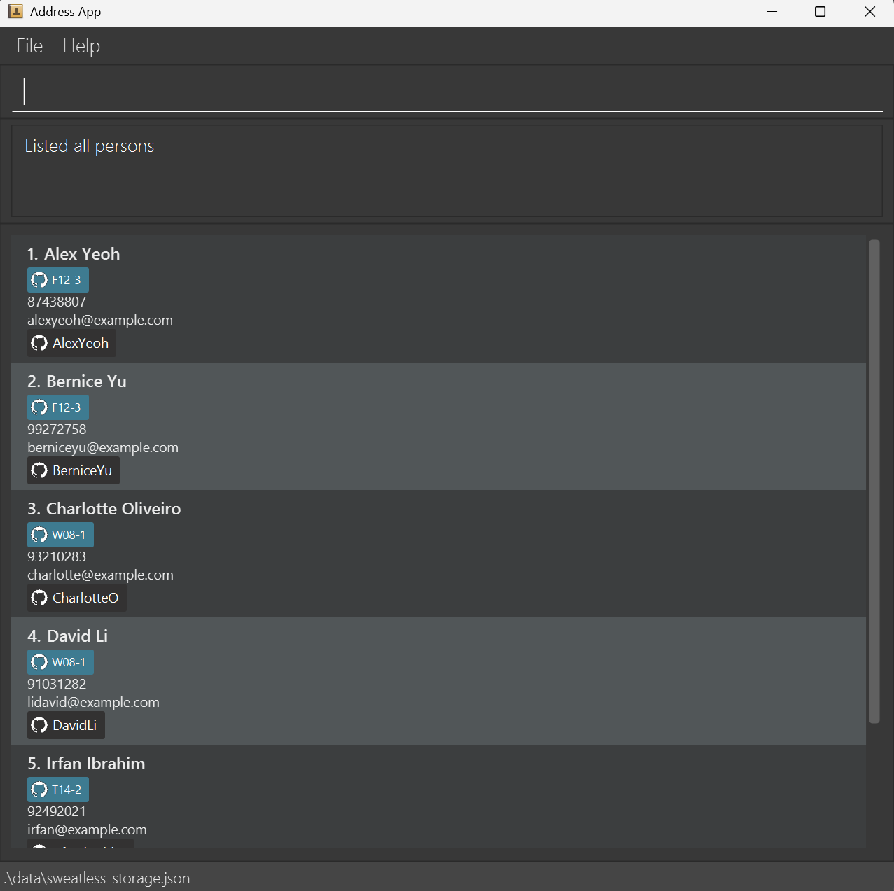
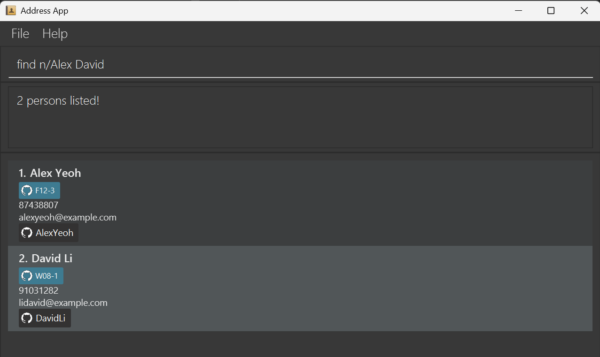

SWEatless is a desktop application for **teaching staff who favour CLI usage** and want to **access and manage student and team information efficiently**.

* Table of Contents
{:toc}

---

## Command summary

| Action               | Format, Examples                                                                                                                                    |
| -------------------- | --------------------------------------------------------------------------------------------------------------------------------------------------- |
| **Create Student**   | `create_student n/NAME p/PHONE_NUMBER e/EMAIL g/GITHUB_USERNAME​`   e.g., `create_student n/James Ho p/22224444 e/jamesho@example.com g/jamesho` |
| **Delete Student**   | `delete_student INDEX` or `delete_student e/EMAIL`  e.g., `delete_student 3` or `delete_student e/johndoe@example.com`                         |
| **Edit Student**     | `edit_student INDEX [n/NAME] [p/PHONE_NUMBER] [e/EMAIL] [g/GITHUB_USERNAME]​`  e.g.,`edit_student 2 n/James Lee e/jameslee@example.com`          |
| **Create Team**      | `create_team t/TEAM_NAME`   e.g., `create_team F12-3`                                                                                            |
| **Delete Team**      | `delete_team t/TEAM_NAME`  e.g., `delete_team F12-3`                                                                                             |
| **Add To Team**      | `add_to_team INDEX t/TEAM_NAME`   e.g., `add_to_team 1 t/F12-3`                                                                                  |
| **Remove from Team** | `remove_from_team INDEX t/TEAM_NAME`  e.g., `remove_from_team 3 t/F12-3`                                                                         |
| **Find**             | `find n/[MORE_NAMES] t/[MORE_TEAM_NAMES]`  e.g., `find n/James Jake t/F12-3`                                                                     |
| **List**             | `list`                                                                                                                                              |
| **Clear**            | `clear`                                                                                                                                             |
| **Exit**             | `exit`                                                                                                                                              |
| **Help**             | `help`                                                                                                                                              |

## Quick start

1. Ensure you have Java `17` or above installed in your Computer. 
   **Mac users:** Ensure you have the precise JDK version prescribed [here](https://se-education.org/guides/tutorials/javaInstallationMac.html).

1. Download the latest `.jar` file from [here](https://github.com/se-edu/addressbook-level3/releases).

1. Copy the file to the folder you want to use as the _home folder_ for SWEatless.

1. Open a command terminal, `cd` into the folder you put the jar file in, and use the `java -jar SWEatless.jar` command to run the application. 
   A GUI similar to the below should appear in a few seconds. Note how the app contains some sample data. 
   

1. Type the command in the command box and press Enter to execute it. e.g. typing **`help`** and pressing Enter will open the help window. 
   Some example commands you can try:

   - `list` : Lists all contacts.

   - `create_student n/John Doe p/98765432 e/johnd@example.com g/johnd` : Adds a contact named `John Doe` to SWEatless.

   - `delete_student 3` : Deletes the 3rd contact shown in the current list.
   - `delete_student e/johnd@example.com` : Deletes the contact with the specified email.

   - `clear` : Deletes all contacts.

   - `exit` : Exits the app.

1. Refer to the [Features](#features) below for details of each command.

---

## Features

**:information_source: Notes about the command format:** 

- Words in `UPPER_CASE` are the parameters to be supplied by the user. 
  e.g. in `add n/NAME`, `NAME` is a parameter which can be used as `add n/John Doe`.

- Parameters can be in any order. 
  e.g. if the command specifies `n/NAME p/PHONE_NUMBER`, `p/PHONE_NUMBER n/NAME` is also acceptable.

- Extraneous parameters for commands that do not take in parameters (such as `help`, `list`, `exit` and `clear`) will be ignored. 
  e.g. if the command specifies `help 123`, it will be interpreted as `help`.

- If you are using a PDF version of this document, be careful when copying and pasting commands that span multiple lines as space characters surrounding line-breaks may be omitted when copied over to the application.

### Name Constraints

- Format: Names should only contain alphanumeric characters and spaces, and should not be blank
- Rules:
  - Must start with a letter or number
  - Can contain letters, numbers, and spaces
  - Cannot start with whitespace
  - Cannot contain special characters like !@#$%^&\*()

Valid Examples: John Doe, Alice123, Mary Jane Smith  
Invalid Examples: John (starts with space), John@Doe (special character), empty string

### Phone Number Constraints

- Format: Phone numbers should only contain numbers, and should be at least 3 digits long
- Rules:
  - Must contain only digits (0-9)
  - Must be at least 3 digits long
  - No spaces, dashes, parentheses, or other characters allowed

Valid Examples: 123, 1234567890, 999  
Invalid Examples: 12 (too short), 123-456-7890 (contains dashes), abc123 (contains letters)

### Email Constraints

- Format: Emails should be of the format local-part@domain and adhere to specific constraints
- Rules:
  - Local part (before @):
    - Only alphanumeric characters and special characters: +\_.-
    - Cannot start or end with special characters
  - Domain part (after @):
    - Must have at least 2 characters in the final domain label
    - Each domain label must start and end with alphanumeric characters
    - Domain labels can contain hyphens but not at the start/end
    - Must have at least one period separating domain labels

Valid Examples: user@example.com, test.email+tag@domain.co.uk, user123@sub.domain.org  
Invalid Examples: user@domain (no TLD), .user@domain.com (starts with dot), user@.domain.com (starts with dot)

### GitHub Username Constraints

- Format: GitHub usernames must be 1-39 characters, alphanumeric or hyphens, cannot start or end with a hyphen, and cannot have consecutive hyphens
- Rules:
  - Must be 1-39 characters long
  - Can contain letters (a-z, A-Z), numbers (0-9), and hyphens (-)
  - Cannot start with a hyphen
  - Cannot end with a hyphen
  - Cannot have consecutive hyphens (--)

Valid Examples: john-doe, alice123, user-name, a (single character)  
Invalid Examples: -username (starts with hyphen), username- (ends with hyphen), user--name (consecutive hyphens), empty string

### Team Name Constraints

- Format: Team names should adhere to specific constraints
- Rules:
  - First character (day): M, W, T, F
  - Second and third character (time): 08, 09, 10, 11, 12, 13, 14, 15, 16, 17
  - Fourth character (hyphen): -
  - Fifth character (team number): 1, 2, 3, 4

Valid Examples: F12-3, T11-1, M08-4, W17-2
Invalid Example: S12-3 (invalid day), M11-6 (invalid team number), T01-2 (invalid time)

### Index Constraints

- Format: Index should only contain numbers
- Rules:
  - One-based indexing is used
  - Must be a non-zero positive integer

Valid Examples: 1, 2, 5, 90
Inavlid Examples: 0 (is not non-zero), -1 (is not positive), abc (contains non-numeric characters)

### Creating a student: `create_student`

Creates a student to add to SWEatless.

Format: `create_student n/NAME p/PHONE_NUMBER e/EMAIL g/GITHUB_USERNAME​`

Examples:

- `create_student n/John Doe p/98765432 e/johnd@example.com g/johnd`
- `create_student n/Betsy Crowe e/betsycrowe@example.com p/97121323 g/betsycrowe`

### Deleting a student : `delete_student`

Deletes the specified student from the address book.

Format: `delete_student INDEX` OR `delete_student e/EMAIL`

- Deletes the student at the specified `INDEX` OR the student with the matching `EMAIL`.
- The index refers to the index number shown in the displayed student list.
- The index **must be a positive integer** 1, 2, 3, …​
- The email matching is **case-insensitive** (e.g., `JohnDoe@Example.com` will match `johndoe@example.com`).
- Only one method (index or email) can be used at a time.

Examples:

- `delete_student 1` Deletes the 1st student in the list.
- `delete_student e/johndoe@example.com` Deletes the student with email `johndoe@example.com`.

### Editing a student : `edit_student`

Edits an existing student in SWEatless.

Format: `edit_student INDEX [n/NAME] [p/PHONE] [e/EMAIL] [g/GITHUB_USERNAME]`

- Edits the student at the specified `INDEX`. 
- The index refers to the index number shown in the displayed student list.
- At least one of the optional fields must be provided.
- Existing values will be updated to the input values.

Examples:

- `edit_student 1 p/91234567 e/johndoe@example.com` Edits the phone number and email address of the 1st student to be `91234567` and `johndoe@example.com` respectively.
- `edit_student 2 n/Betsy Crower` Edits the name of the 2nd student to be `Betsy Crower`

### Creating a team: `create_team`

Creates a team to add to SWEatless.

Format: `create_team t/TEAM_NAME`

Examples:

- `create_team t/F12-3`

### Deleting a team: `delete_team`

Deletes the specified team from SWEatless.

Format: `delete_team t/TEAM_NAME`

Examples:

- `delete_team t/F12-3`

### Adding a student to a team: `add_to_team`

Adds the specificed student to the specified team in SWEatless.

Each team can only have 5 students.

Each student can only be added to 1 team at a time.

Format: `add_to_team INDEX t/TEAM_NAME`

Examples:

- `add_to_team 2 t/F12-3`

### Removing a student from a team: `remove_from_team`

Removes the specificed student from the specified team in SWEatless.

Format: `remove_from_team INDEX t/TEAM_NAME`

Examples:

- `remove_from_team 1 t/T11-4`

### Locating persons by name or team: `find`

Finds students whose names contain any of the specified keywords or who belong in any of the specified teams (case-insensitive) and displays them as a list with index numbers.

Format: `find n/[MORE_NAMES] t/[MORE_TEAM_NAMES]`

- At least one of the optional fields must be provided.
- The search is case-insensitive. e.g `hans` will match `Hans`
- The order of the keywords does not matter.
- Only the name and/or team name is searched.
- Only full words will be matched e.g. `Han` will not match `Hans`

Examples:

- `find n/John` returns `john` and `John Doe`
- `find n/alex david` returns `Alex Yeoh`, `David Li` 
  *Students matching at least one name keyword will be returned (i.e. `OR` search)*
  
- `find t/F12-3` returns all students from team `F12-3`
- `find t/F12-3 T11-2` returns all students from team `F12-3` and `T11-2` 
  *Students matching at least one team keyword will be returned (i.e. `OR` search)*
- `find n/alex david t/F12-3 T11-2` returns all students from team `F12-3` and `T11-2` with names `Alex` or `David` 
  *If both `n/` and `/t` tags are used, students with the queried names in the specified teams will be returned (i.e. `AND` search)*

### Listing all students : `list`

Shows a list of all students in SWEatless.

Format: `list`

Examples:

- `list` followed by `delete_student 2` deletes the 2nd student in SWEatless.
- `find n/Betsy` followed by `delete_student 1` deletes the 1st student in the results of the `find` command.
- `delete_student e/betsy@example.com` deletes the student with the email `betsy@example.com`.

### Clearing all entries : `clear`

Clears all entries from SWEatless.

Format: `clear`

### Exiting the program : `exit`

Exits the program.

Format: `exit`

### Viewing help : `help`

Shows a message explaining how to access the help page.

Format: `help`

### Saving the data

SWEatless data are saved in the hard disk automatically after any command that changes the data. There is no need to save manually.

### Editing the data file

SWEatless data are saved automatically as a JSON file `[JAR file location]/data/addressbook.json`. Advanced users are welcome to update data directly by editing that data file.

:exclamation: **Caution:**
If your changes to the data file makes its format invalid, SWEatless will discard all data and start with an empty data file at the next run. Hence, it is recommended to take a backup of the file before editing it. 
Furthermore, certain edits can cause the SWEatless to behave in unexpected ways (e.g., if a value entered is outside of the acceptable range). Therefore, edit the data file only if you are confident that you can update it correctly.

---

## FAQ

**Q**: How do I transfer my data to another Computer? 
**A**: Install the app in the other computer and overwrite the empty data file it creates with the file that contains the data of your previous SWEatless home folder.

---

## Known issues

1. **When using multiple screens**, if you move the application to a secondary screen, and later switch to using only the primary screen, the GUI will open off-screen. The remedy is to delete the `preferences.json` file created by the application before running the application again.
2. **If you minimize the Help Window** and then run the `help` command (or use the `Help` menu, or the keyboard shortcut `F1`) again, the original Help Window will remain minimized, and no new Help Window will appear. The remedy is to manually restore the minimized Help Window.

---
